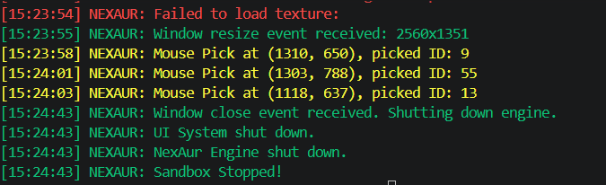
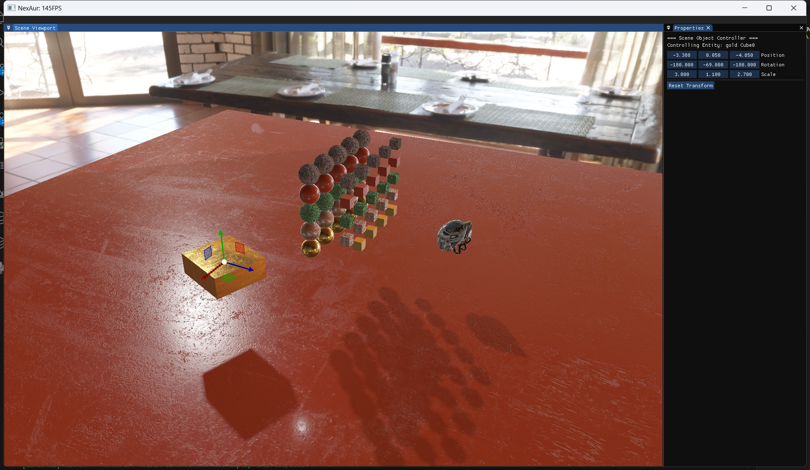
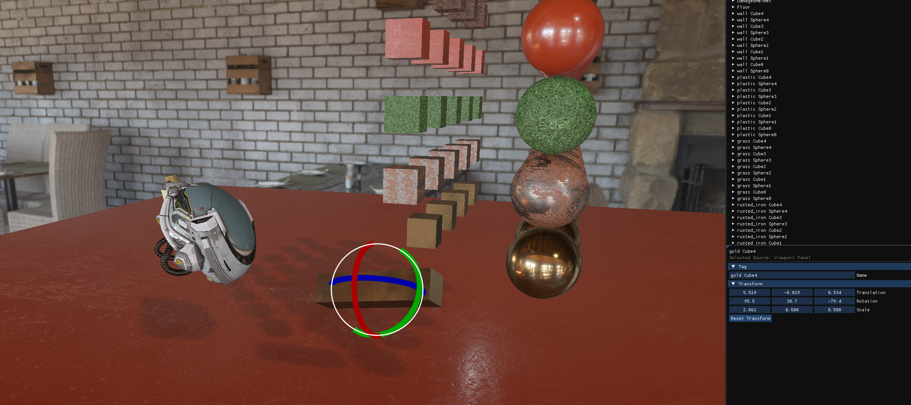

# NexAur
本项目用于学习和研究游戏引擎开发, NexAur是长期开发和维护的个人小型游戏引擎项目。(有时间就开发 = =。。)

## 代码风格
- [代码风格文档](./docs/CodingGuideLines/CodingGuideLines.md)

## 进度
###  日志系统：v1版本全局日志系统开发完成(后续再升级)

###  输入系统: v1版本轮询模式事件系统设计完成
- [输入系统文档](./docs/architecture/InputSystem/Input.md)

### 渲染模块：Vulkan 主线渲染器开发中
- 当前主渲染后端已切换到 Vulkan 1.3，OpenGL 路径不再作为主线维护。
- 已完成基础渲染链路：swapchain、viewport target、pass graph、forward scene、object picking、debug draw、ImGui composite。
- 已接入画面基础：HDR scene color、ACES tone mapping、exposure、Physically Based Bloom、PBR metallic-roughness material、IBL、skybox。
- 阴影系统已支持 directional shadow、PCF / Poisson PCF、CSM、PCSS / contact hardening。
- glTF 2.0 / GLB 模型主导入路径已切换到 tinygltf，Assimp 作为非 glTF fallback / 后续离线工具边界保留。

### 事件系统: v1版本总线事件派发结构编写完成
- [事件系统文档](./docs/architecture/EventSystem/EventSystem.md)

###  编辑器：开发中
- 视口面板，场景层级面板，实体属性面板正在开发中

## 技术栈

- **C++20 / CMake / vcpkg**: 引擎主线使用 C++20，CMake 负责工程组织，第三方依赖统一走 vcpkg。
- **Vulkan 1.3**: 当前主渲染后端，包含 swapchain、dynamic rendering、pass graph、HDR scene color、PBR、IBL、Bloom、Shadow / CSM / PCSS、debug draw 与 editor viewport 输出。
- **HLSL + DXC -> SPIR-V**: Vulkan shader 使用 HLSL 编写，由 DXC 编译为 SPIR-V，shader 按 forward、bloom、shadow、common include 等目录组织。
- **vk-bootstrap / volk / Vulkan Memory Allocator**: 简化 Vulkan instance / device 初始化、函数加载与 GPU 资源内存管理。
- **GLFW**: 负责窗口创建、Vulkan surface 和键盘 / 鼠标输入接入。
- **Dear ImGui Docking + ImGuizmo**: 构建编辑器 UI、Dockspace、Scene Viewport、Inspector、Hierarchy、Content Browser、Console、Renderer Debug 与 gizmo 操作。
- **EnTT**: ECS 基础设施，支撑 Scene、Entity、Component 和 runtime gameplay systems。
- **glm**: 数学库，用于向量、矩阵、相机、Transform、PBR / Shadow / Physics 等计算。
- **spdlog / fmt**: 日志与格式化输出，服务于引擎核心、编辑器和调试工具。
- **tinygltf**: glTF 2.0 / GLB runtime 主导入路径，负责解析几何、节点层级、PBR 材质和贴图引用。
- **Assimp**: 作为补充导入器 / fallback importer，主要面向非 glTF 格式或后续离线转换工具。
- **stb_image**: 纹理与 HDR environment 图像解码，服务于材质贴图和 IBL 资源加载。
- **nlohmann/json**: 场景序列化、配置和轻量数据交换。
- **miniaudio**: Audio v1 后端，提供轻量音频播放基础能力。

